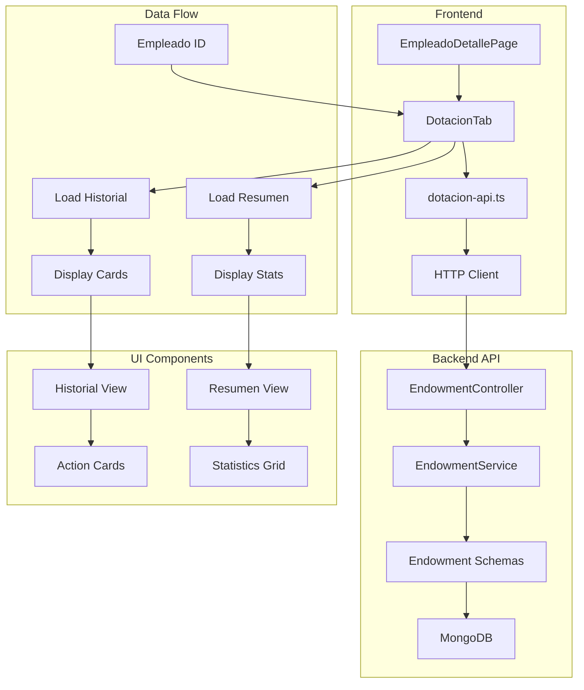
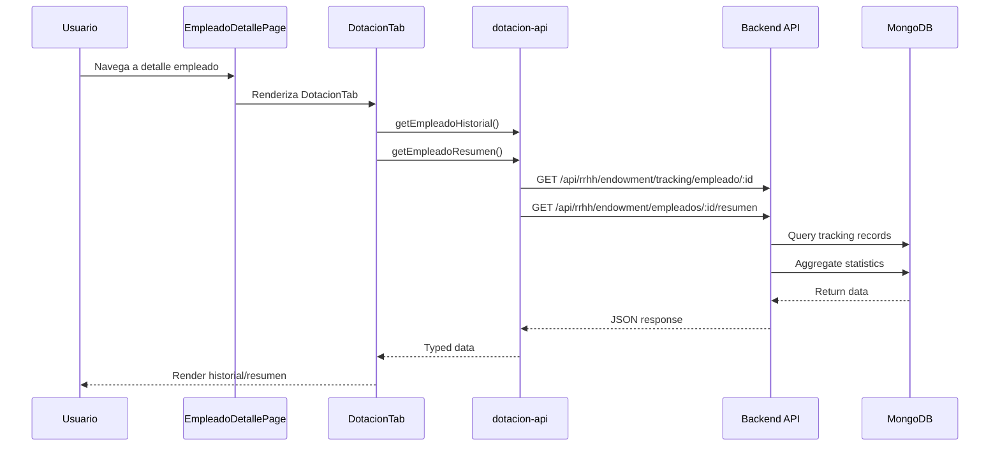
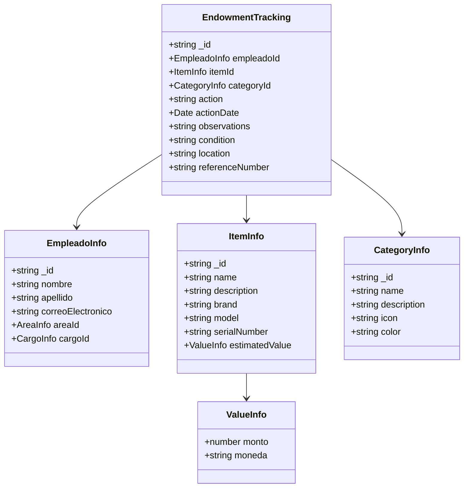
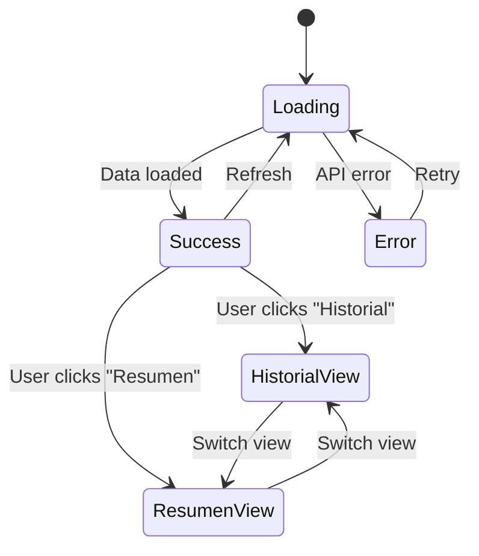
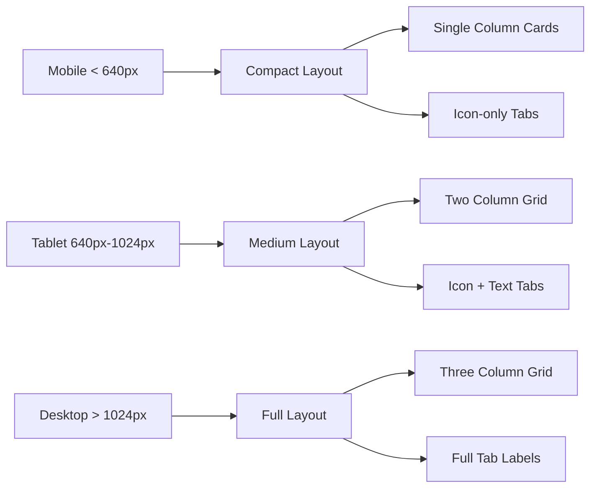

# Arquitectura del Módulo de Dotación

## Diagrama de Componentes

```mermaid
graph TB
    subgraph "Frontend"
        A[EmpleadoDetallePage] --> B[DotacionTab]
        B --> C[dotacion-api.ts]
        C --> D[HTTP Client]
    end
    
    subgraph "Backend API"
        D --> E[EndowmentController]
        E --> F[EndowmentService]
        F --> G[Endowment Schemas]
        G --> H[MongoDB]
    end
    
    subgraph "Data Flow"
        I[Empleado ID] --> B
        B --> J[Load Historial]
        B --> K[Load Resumen]
        J --> L[Display Cards]
        K --> M[Display Stats]
    end
    
    subgraph "UI Components"
        L --> N[Historial View]
        M --> O[Resumen View]
        N --> P[Action Cards]
        O --> Q[Statistics Grid]
    end
```

## Flujo de Datos

```mermaid
sequenceDiagram
    participant U as Usuario
    participant E as EmpleadoDetallePage
    participant D as DotacionTab
    participant A as dotacion-api
    participant B as Backend API
    participant DB as MongoDB
    
    U->>E: Navega a detalle empleado
    E->>D: Renderiza DotacionTab
    D->>A: getEmpleadoHistorial()
    D->>A: getEmpleadoResumen()
    A->>B: GET /api/rrhh/endowment/tracking/empleado/:id
    A->>B: GET /api/rrhh/endowment/empleados/:id/resumen
    B->>DB: Query tracking records
    B->>DB: Aggregate statistics
    DB-->>B: Return data
    B-->>A: JSON response
    A-->>D: Typed data
    D-->>U: Render historial/resumen
```

## Estructura de Datos

```mermaid
classDiagram
    class EndowmentTracking {
        +string _id
        +EmpleadoInfo empleadoId
        +ItemInfo itemId
        +CategoryInfo categoryId
        +string action
        +Date actionDate
        +string observations
        +string condition
        +string location
        +string referenceNumber
    }
    
    class EmpleadoInfo {
        +string _id
        +string nombre
        +string apellido
        +string correoElectronico
        +AreaInfo areaId
        +CargoInfo cargoId
    }
    
    class ItemInfo {
        +string _id
        +string name
        +string description
        +string brand
        +string model
        +string serialNumber
        +ValueInfo estimatedValue
    }
    
    class CategoryInfo {
        +string _id
        +string name
        +string description
        +string icon
        +string color
    }
    
    class ValueInfo {
        +number monto
        +string moneda
    }
    
    EndowmentTracking --> EmpleadoInfo
    EndowmentTracking --> ItemInfo
    EndowmentTracking --> CategoryInfo
    ItemInfo --> ValueInfo
```

## Estados del Componente

```mermaid
stateDiagram-v2
    [*] --> Loading
    Loading --> Success: Data loaded
    Loading --> Error: API error
    Success --> HistorialView: User clicks "Historial"
    Success --> ResumenView: User clicks "Resumen"
    HistorialView --> ResumenView: Switch view
    ResumenView --> HistorialView: Switch view
    Error --> Loading: Retry
    Success --> Loading: Refresh
```

## Responsive Breakpoints

```mermaid
graph LR
    A[Mobile < 640px] --> B[Compact Layout]
    C[Tablet 640px-1024px] --> D[Medium Layout]
    E[Desktop > 1024px] --> F[Full Layout]
    
    B --> G[Single Column Cards]
    B --> H[Icon-only Tabs]
    
    D --> I[Two Column Grid]
    D --> J[Icon + Text Tabs]
    
    F --> K[Three Column Grid]
    F --> L[Full Tab Labels]
```
